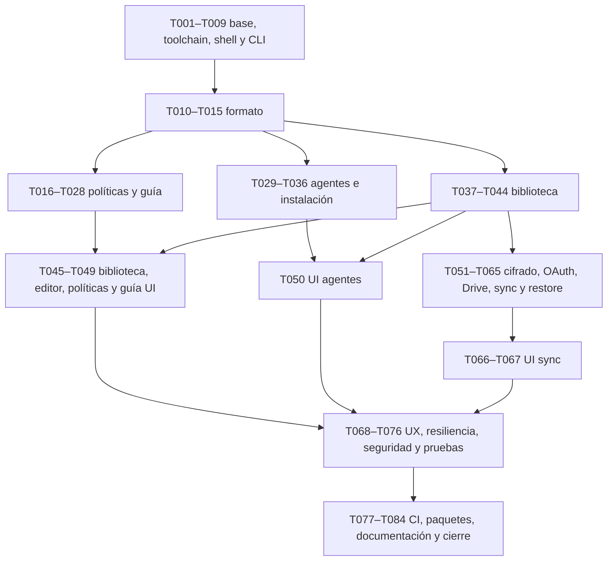

# Plan completo de implementación: JameSkills v1

Estado: **plan documental; ninguna tarea de implementación está completada**. Fecha: 2026-10-02. Autor de este plan: GPT-6.1 Sol. Ejecutor previsto: GPT6 Luna. El usuario autoriza elaborar el alcance completo sin revisiones obligatorias entre fases. La implementación de la aplicación empieza en otra ejecución.

## 1. Resultado y fuente de verdad

Construir una aplicación de escritorio nativa en Rust, GPUI y **GPUI Kit**, para Windows y Linux, que permita crear, editar, importar, validar, versionar e instalar suites de skills y respaldarlas/restaurarlas cifradas mediante Google Drive. La aplicación presenta requisitos dependientes del entorno como una guía dinámica con evidencia, capacidades y pasos verificables.

La v1 termina con todos los recorridos de `docs/GUI.md`, las seis capacidades de `CAPABILITY-MAP.md`, una CLI reutilizable en CI, paquetes instalables de ambos sistemas y evidencia de los criterios de aceptación. Una primera demo local no completa este plan. Los cinco agentes documentados tienen adaptadores: Codex, OpenCode, Pi, Antigravity CLI (`agy`) y Grok Build CLI (`grok`). Cada perfil comprueba versión y capacidades; las funcionalidades sin contrato upstream siguen deshabilitadas.

Precedencia: instrucciones actuales del usuario → contratos y requisitos de `docs/CONTRACTS.md`, `docs/SPEC-*.md`, `docs/ARCHITECTURE.md` y `docs/SECURITY.md` → `docs/GUI.md`/`docs/TESTING.md` → tareas. `docs/SOURCES.md` registra la evidencia upstream. Si dos documentos se contradicen, actualizar el contrato y la tarea antes de implementar; no resolverlo silenciosamente dentro del código.

| Capacidad | Especificación | Tareas principales |
|---|---|---|
| `skill-format` | `docs/SPEC-skill-format.md` | T010–T015 |
| `policy-engine` | `docs/SPEC-policy-engine.md` | T016–T028, T045, T048–T049 |
| `agent-adapters` | `docs/SPEC-agent-adapters.md` | T029–T036, T050 |
| `skill-library` | `docs/SPEC-skill-library.md` | T037–T047 |
| `cloud-sync` | `docs/SPEC-cloud-sync.md` | T051–T067 |
| `desktop-app` | `docs/SPEC-desktop-app.md` | T001–T009, T046–T050, T066–T073, T076 |
| Integración, distribución y operación | Arquitectura, seguridad, pruebas y fuentes | T074–T084 |

## 2. Decisiones ya tomadas

1. Cuatro crates: `jameskills-core`, `jameskills-infra`, `jameskills-desktop`, `jameskills-cli`. El dominio y los casos de uso no importan GPUI, HTTP, SQLite ni implementaciones de plataforma. Infraestructura implementa puertos; desktop y CLI comparten servicios.
2. GPUI Kit es el kit solicitado: `gpui-kit`, documentación oficial `https://gpui-kit.com`. La fuente y registry verificadas fijan `gpui-kit = "=0.7.0"`; 0.6.5 está yanked y la documentación de instalación antigua no manda sobre el release. GPUI compatible es snapshot 0.3.7, mediante los reexports del kit; T001 verifica MSRV 1.92.0 y lockfile. Usar `with_assets(assets::Assets)` e `init(cx)`; `gpui_kit::open_window` instala el Root, sin envolverlo dos veces. Usar los componentes e iconos documentados del kit. No sustituirlo por una dependencia de nombre parecido ni por una aplicación web.
3. Suite portable: `SKILL.md` con formato Agent Skills, `jameskills.toml` con `schema_version = 1`, ID UUID, versión y capacidades, `policies/*.toml` tipadas y carpetas de assets/references/guidance/templates. Importar una suite no ejecuta sus scripts ni comandos.
4. Requisitos declarativos se evalúan con herramientas registradas y argumentos tipados. `ProcessSpec` lleva ejecutable absoluto aprobado y `argv`; ninguna política suministra una cadena para `sh -c`, PowerShell `-Command` o `cmd /c`.
5. Validación local, hooks eludibles, CI requerida y reglas del proveedor tienen alcances distintos. Requirement.enforcement exige autoridad; CheckResult.enforcement registra autoridad observada. Un mensaje válido no demuestra un hook instalado ni un workflow válido una regla host/CI requerida. “Main protegida” exige evidencia remota vigente. La app muestra lo que pudo comprobar; un permiso ausente produce estado desconocido o bloqueado, nunca aprobado.
6. Adaptadores documentados: Codex (`.agents/skills`), OpenCode (`.opencode/skills` y config user), Pi (`.pi/skills`, user `<PI_CODING_AGENT_DIR>/skills` o default), Antigravity CLI (plugin `jameskills-<slug>` con `plugin.json` y `skills/<slug>/SKILL.md`, instalado mediante `agy plugin install <localpath>`) y Grok Build (`.grok/skills`, user `<GROK_HOME>/skills` o default). Las rutas y overrides se resuelven por plataforma según fuentes. Antigravity CLI no tiene destino standalone de proyecto verificado y lo declara Unsupported; no usar rutas del IDE para su CLI.
7. Biblioteca local con SQLite para metadatos y blobs/revisiones inmutables. IDs, hashes, revisión base y transacciones evitan sobrescrituras silenciosas. Revisiones y tombstones mantienen causalidad; los relojes sirven para presentación.
8. Google Drive API v3, scope `drive.appdata`, `appDataFolder`. Cada snapshot completo es un objeto cifrado inmutable identificado por UUID; sus parents forman un DAG dentro del payload. Enumerar y unir snapshots, sin un HEAD mutable ni supuesto CAS no documentado. No hay GC remota automática en v1.
9. Cifrado v1: llave maestra aleatoria de 32 bytes, envoltura mediante passphrase derivada con Argon2id (65.536 KiB, t=3, p=1, salt aleatoria de 16 bytes), XChaCha20Poly1305 y nonces independientes de 24 bytes. Para cada snapshot se envuelve master usando wrappingkey retenida en sesión y AAD de ese header; ambas llaves se limpian al lock. Header tipado autenticado, tamaños acotados y bytes exactos definidos por `docs/SPEC-cloud-sync.md` y referenciados en `docs/SECURITY.md`. Nunca diseñar un cifrado alternativo durante la implementación.
10. Tokens OAuth en keyring del sistema. UnlockedVault conserva master+wrappingkey+salt+vaultID con constructor controlado; passphrase se destruye tras KDF. Cache de ese material versionado solo opt-in; sin keyring la conexión cloud persistente queda Blocked; biblioteca offline y export cifrado manual siguen funcionando sin guardar tokens o llaves en plaintext. Recuperación portable exige passphrase y backup exportado.

## 3. Estructura y contratos de ejecución

```text
crates/jameskills-core/src/
  domain/{mod,ids,skill,policy,agent,library,sync,guidance}.rs
  application/{mod,library,policy,install,sync,guidance}.rs
  ports/{mod,storage,filesystem,process,agent,remote,crypto,secrets,clock}.rs
crates/jameskills-infra/src/
  sqlite.rs fs.rs process.rs platform.rs crypto.rs keyring.rs github.rs
  agents/{codex,opencode,pi,antigravity,grok}.rs
  google/{oauth,drive}.rs
crates/jameskills-desktop/src/
  main.rs composition.rs bridge.rs state.rs routes.rs theme.rs
  views/ components/
crates/jameskills-cli/src/{main,commands,output}.rs
docs/          # Contratos y documentación para usuario/desarrollador
examples/      # Suites propias sin secretos
scripts/       # Setup, empaquetado y verificación reproducibles
packaging/     # Manifiestos de instaladores/iconos/licencias
tests/fixtures/ # Datos adversos e integración; nunca credenciales reales
tasks/         # Este plan, checklist y estado de reanudación
```

Las firmas públicas de `docs/CONTRACTS.md` son canónicas. Los nombres adicionales de función en `todo.md` son helpers privados propuestos, no APIs públicas nuevas; conservar métodos públicos como `publish`, `check`, `advance/recheck`, `sync_once` y los nombres de ports exactos. La tarea define responsabilidades y pruebas; si necesita una API pública adicional, registrar primero el contrato en el dossier. Crear archivos a medida que hacen falta; no poblar todas las carpetas con stubs que devuelvan éxito.

| Frontera | Contrato | Wiring obligatorio |
|---|---|---|
| Dominio/casos de uso | `ApplicationServices`; errores tipados y resultados estructurados | CLI y desktop invocan los mismos servicios |
| Persistencia | `StoragePort` + revisiones base + transacciones | SQLite y blobs locales, no conexiones en widgets |
| Archivos/procesos | `FileSystemPort`, `ProcessPort`, `ProcessSpec` | Safe paths y herramientas aprobadas; tests con fakes |
| Agentes | `AgentPort`; capacidades, detección, plan de instalación | Adaptadores documentados; dry run y journal antes de escribir |
| Remoto | `RemoteSnapshotPort` y cliente Drive detrás del puerto | Listado paginado y snapshots inmutables |
| Cripto/secretos | `CryptoPort`, `SecretStorePort`, `ClockPort` | Cifrado estándar, keyring, tiempo/control de reintentos reemplazables |
| UI/asíncrono | bridge de commands/events con `request_id`, revisión base y cancelación | GPUI solo renderiza/recibe progreso; completion valida IDs/revisión |

Los contratos de CONTRACTS describen el estado final. Construirlos incrementalmente: T007 introduce IDs/errores/clock/config y namespaces; T013 define RevisionRecord/hash causal antes de StoragePort; T051.a define SnapshotPayload/SecretInput antes de CryptoPort/seal; T059/T061 añaden capture_snapshot/merge_snapshot cuando sus DTOs/providers están implementados. La factory registra únicamente servicios disponibles y las acciones sin backend se muestran no disponibles; nunca crear un success placeholder ni referenciar tipos inexistentes. T003.b configura desktop test-support y todas las slices UI lo invocan desde sus primeras pruebas.

La fábrica de servicios pertenece a infraestructura/composición y recibe configuración tipada. Desktop tiene un único composition root; CLI usa la misma construcción sin inicializar GPU ni una sesión gráfica. Cada acción visible debe tener un caso de uso real y estados vacío, cargando, éxito, error, bloqueado y cancelado aplicables. Los ejemplos/fakes pertenecen a pruebas y previews; no se enlazan al ejecutable release.

## 4. DAG y orden

`todo.md` contiene dependencias por tarea. Un ID mayor no significa que todas las tareas anteriores sean dependencias. Seleccionar la primera pendiente cuyas dependencias estén completas; T015 depende de T037, T035 de T037/T038 y T028 de T039/T042 y T025 de T037 por los contratos de factory/journal/lookup UUID; el orden topológico calculado se publica en todo.md (los IDs numéricos son estables, no un orden de ejecución) y permite avanzar ante bloqueos de credenciales sin ejecutar una tarea dependiente bloqueada.



La organización reduce el riesgo temprano: T001–T005 prueban disponibilidad real de GPUI Kit y plataformas; T012 bloquea importaciones peligrosas; T035–T036 prueban instalación transaccional antes de exponerla; T051–T058 cierran criptografía y protocolo antes de escribir backup remoto. No se posponen los conflictos ni la restauración para después de declarar sync terminado.

## 5. Receta de cada tarea

1. Leer su especificación y los archivos listados. Inspeccionar `git status --short`; preservar trabajo previo. Consultar fuentes oficiales si la tarea declara una integración/versionado.
2. Añadir primero la prueba de comportamiento indicada y ejecutar el comando enfocado. Registrar el fallo esperado por comportamiento ausente; un error de sintaxis, import faltante o red caída no demuestra la prueba. En tareas de bootstrap/configuración, usar primero una comprobación del requisito o validación del manifiesto; no fabricar una prueba para obtener un rojo artificial.
3. Implementar lo mínimo que cumple el contrato. Registrar los módulos nuevos y conectar el servicio/acción dentro del presupuesto de archivos. Si aparecen más de cinco archivos necesarios, dividir la tarea en Txxx.a/Txxx.b, documentar dependencias y mantener pendiente el ID principal hasta cerrar ambas.
4. Ejecutar prueba enfocada, formato, lint/build aplicables. Revisar errores, serialización, cancelación y superficies de confianza cambiadas. No eliminar una prueba válida ni bajar umbrales para lograr verde.
5. Completar los tres criterios de aceptación y registrar evidencia. Solo entonces marcar el checkbox de la tarea. Mantener “pendiente/bloqueada” cuando falta plataforma o credencial requerida; no convertir un mock en evidencia del entorno real.
6. Hacer un commit convencional por tarea o subtarea en una rama de trabajo. No escribir sobre `main` remota ni publicar por la mera existencia de este plan.
7. Cada tres tareas principales y también tras un máximo de tres subtareas verificadas ejecutar el checkpoint correspondiente; es verificación automática y registro, no una aprobación humana de fase.

La lista de archivos es un presupuesto real, incluida integración y tests; no ocultar cambios en Cargo.toml, registradores, composition roots o fixtures como “glue”. Si una API común cambia, actualizar primero arquitectura/spec y sus consumidores, en una subtarea explícita.

## 6. Comandos reproducibles

Estos comandos son de implementación futura: no se han ejecutado al escribir el plan. T001/T004 crean o verifican los requisitos y T002/T003 crean los targets. Después se ejecutan desde la raíz del repositorio.

```bash
rustc --version
cargo --version
git --version
rustup show active-toolchain
cargo metadata --format-version 1 --no-deps
cargo fmt --all -- --check
cargo clippy --workspace --all-targets --locked -- -D warnings
cargo test -p jameskills-core -p jameskills-infra -p jameskills-cli --locked
cargo test --workspace --features jameskills-desktop/test-support --locked
cargo build -p jameskills-cli --locked
cargo run -p jameskills-cli --locked -- --help
cargo run -p jameskills-desktop --locked
cargo build -p jameskills-desktop --release --locked
cargo run -p jameskills-cli --locked -- validate --path examples/repository-foundation --json
cargo run -p jameskills-cli --locked -- library import --path examples/repository-foundation --json
cargo run -p jameskills-cli --locked -- check --skill f9c0199f-c4ce-4b04-85dd-ae12a7db292b --repo . --profile rust --json --strict
cargo run -p jameskills-cli --locked -- doctor --json
```

Las pruebas focalizadas de cada tarea usan filtros reales de `cargo test`. La tarea define funciones `#[test]` con el prefijo mostrado; si no se ejecuta ninguna prueba, la verificación falla y se corrige el filtro. Core y CLI permanecen verificables sin GPU; desktop exige los prerrequisitos de GPUI. No usar `--locked` antes de crear el lockfile inicial; tras generarlo en T003, commitearlo y usarlo siempre. El lint de workspace solo se considera completo en una máquina que puede compilar sus crates, no con desktop omitido silenciosamente.

Los subcomandos y exit codes exactos de `docs/CONTRACTS.md` son autoridad. Validar usa `validate --path <bundle> --json`; importar usa `library import --path <bundle|jskill> --json`; comprobar usa `check --repo <path> --skill <uuid-importado> --profile <rust|node|generic> --json --strict`. Exportar usa `library export --skill <uuid> --output <path.jskill> --json`. Instalación: `install plan --skill <uuid> --agent <id> --scope <user|project> [--repo <path>] --output <plan.json>`, después `install apply --plan <plan.json> --confirm-digest <sha256>`; el archivo de plan no es autoridad para ejecutar campos arbitrarios. Restauración: `backup restore --input <path> --preview`, después `backup restore --input <path> --apply --confirm-digest <sha256>` de un preview vigente. `doctor --json`, `agents detect --json`, `sync status --json` y `sync run --json` completan diagnóstico/operación. El ejemplo de `check` anterior depende de importar el UUID fijo del golden bundle; no acepta un path en `--skill`.

Ninguna passphrase se pasa como argumento, env, log o diagnóstico. JSON wrapper schema1 y códigos: 0 éxito, 1 requisito obligatorio no cumplido, 2 argumentos/formato, 3 entorno/permiso/auth, 4 IO/red/crypto, 130 cancelación. stdout es resultado JSON saneado, stderr diagnóstico. `doctor` genera guía sin instalar herramientas automáticamente.

### Linux

Objetivo inicial: x86_64 con sesión gráfica real; registrar distro y soporte X11/Wayland/GPU en la matriz de T001. T004 produce `scripts/setup-linux.sh` basado en las dependencias comprobadas de la versión fijada de GPUI Kit/GPUI. En Ubuntu/Debian, usar `apt-cache policy` para comprobar los paquetes antes de sugerir `sudo apt-get install`; en otras distros mostrar equivalentes documentados. Rust se instala según `https://rustup.rs`, toolchain exacta en `rust-toolchain.toml`. No presentar una lista de paquetes de otra versión como garantía.

```bash
bash scripts/setup-linux.sh --check
bash scripts/setup-linux.sh --print-install-plan
cargo build -p jameskills-desktop --locked
cargo run -p jameskills-desktop --locked
bash scripts/package-linux.sh --target x86_64-unknown-linux-gnu
```

`--print-install-plan` imprime prerequisitos y fuentes sin ejecutar sudo. La instalación del sistema necesita privilegios del usuario; el programa informa el motivo y revalida después. CI sin display compila/prueba el core; screenshots/smoke necesitan sesión con renderer apto. No afirmar que Xvfb emula una GPU ni que satisface ambos backends sin evidencia.

### Windows

Objetivo inicial: Windows x86_64 y target `x86_64-pc-windows-msvc`; herramientas oficiales MSVC/Windows SDK y runtime gráfico comprobados en T001/T004. Ejecución en PowerShell nativa, no éxito de compilación Linux presentado como validación Windows.

```powershell
rustup target add x86_64-pc-windows-msvc
pwsh -File scripts/setup-windows.ps1 -Check
pwsh -File scripts/setup-windows.ps1 -PrintInstallPlan
cargo build -p jameskills-desktop --target x86_64-pc-windows-msvc --locked
cargo test --workspace --features jameskills-desktop/test-support --target x86_64-pc-windows-msvc --locked
cargo run -p jameskills-desktop --locked
pwsh -File scripts/package-windows.ps1 -Target x86_64-pc-windows-msvc
```

T004 comprueba qué executable de PowerShell existe y da una alternativa compatible si solo está Windows PowerShell; no exige `pwsh` sin una guía de instalación. Las tareas de Windows y Linux tienen evidencia separada.

## 7. Bloqueos del entorno y guía dinámica

| Dependencia | Qué comprueba la app/ejecutor | Resultado si falta | Ruta de resolución verificable |
|---|---|---|---|
| Registry/toolchain/GPUI Kit | Versión publicada, MSRV, APIs, compilación nativa | Build bloqueado para target afectado | Fuente oficial, versión exacta y prueba mínima; avanzar core independiente |
| GPU/display/driver | Backend y apertura/render de ventana | Smoke gráfico bloqueado | Diagnóstico específico del target; no sustituir stack |
| CLI de agente | Executable/version/capacidad/formato oficial | Agente no detectado/no verificado | Pasos de su fuente oficial y volver a detectar |
| Google OAuth desktop client | Client ID público, tipo Desktop, API/scopes/redirect aceptados | Sync no configurado | Asistente de provisioning en Console, selector de config y recheck |
| Consentimiento/refresh token | Cuenta vinculada, scope correcto, revocación | Login requerido, sin writes remotos | Login en navegador del sistema, PKCE/state, retry controlado |
| Keyring | Vault accesible y prueba write/read/delete de dato descartable | Conexión persistente Blocked; offline/export manual | Desbloquear/configurar vault; nunca fallback de secretos plaintext |
| GitHub/otro host | Proveedor soportado, auth, permisos, ruleset/CI vigente | Evidencia desconocida o paso bloqueado | URL/acción aplicable al entorno detectado; no afirmar protección |
| Signing/publicación | Identidad, permisos y secrets de CI | Artifact local disponible; release publicado pendiente | Provisionar signing en CI/host autorizado y comprobar firma |

El asistente renderiza pasos según facts/capabilities, evita consejos obsoletos, muestra evidencia con fecha y alcance, permite volver a comprobar y no contiene botones “listo” que conviertan manualmente un fallo en pass. Credenciales y acceso faltantes solo bloquean tareas que los necesitan. El ejecutor registra un bloqueo con comandos ya intentados, error saneado, enlace oficial y tareas independientes disponibles; no termina el proyecto por el primer gate del entorno.

## 8. Pruebas y checkpoints

Cada tres tareas principales, `todo.md` incluye C001–C028. Para checkpoint sin GUI disponible: ejecutar core/infra/CLI y compilar target accesible; registrar explícitamente la prueba gráfica/otro OS pendiente. No marcar ese checkpoint completo mientras su criterio obligatorio dependa de evidencia ausente.

Pruebas unitarias de dominio: parsing, canonicalización, estados de policy, causalidad, merge y guidance. Integración con temporales: SQLite, journaling, process argv, blobs y safe paths. HTTP/keyring con dobles deterministas: OAuth, Drive paginado y errores/cancelación. Pruebas de contrato real se ejecutan aparte con cuentas/repos de prueba, mínimo privilegio y sin secretos en fixtures. E2E de CLI ejecutan binario real; E2E nativos ejecutan app real y registran clicks, estado y screenshots.

Priorizar casos que pueden perder datos o engañar al usuario: traversal/symlinks/case collisions, crash entre rename/commit, salida de agente que no es versión, 401/403/429, duplicados Drive, snapshot corrupto, contraseña errónea, KDF hostil, bifurcaciones/tombstones, cuentas cambiadas, restore incompleto y stale completion. Las pruebas criptográficas contrastan vectores/roundtrips de bibliotecas estándar; no implementan primitivas propias.

Criterios de rendimiento y accesibilidad concretos viven en `docs/TESTING.md` y `docs/GUI.md`. T071 establece dataset y máquina de referencia, registra valores y compara los objetivos. No declarar alto rendimiento por estar escrito en Rust.

## 9. Reanudación y registro

`todo.md` es la fuente de estado de tareas. Por cada ID completar `Evidencia` con prueba roja, verde, archivos/commit, criterio manual y bloqueo si existe. Tras cada checkpoint crear/actualizar `tasks/RESUME.md` con: rama+commit, última tarea verificada, próxima elegible, archivos que leer, comandos útiles, contratos modificados, bloqueos y siguiente acción exacta. Tareas pendientes conservan `[ ]`; “código escrito” y “probado en ambos OS” son estados diferentes.

Luna debe leer `HANDOFF-LUNA.md`, `RESUME.md` si existe, el índice de este plan, la tarea actual y solo sus specs/archivos. Antes de continuar verifica el estado Git y evidencia, no vuelve a escribir lo ya terminado. Al recuperar contexto no asume éxito de herramientas cuya salida no quedó registrada. Si una tarea quedó a medias, terminarla o revertir solo sus cambios de forma segura; no avanzar con un checkbox inventado.

## 10. Riesgos y límites de v1

| Riesgo | Mitigación y criterio de salida |
|---|---|
| GPUI Kit cambia APIs/soporte/MSRV | T001 verifica upstream; pins/lockfile; builds y smoke nativos de ambos OS antes de packaging |
| Agentes cambian formatos/rutas | Perfiles versionados con fuente y capability detection; fallar visible; preservar destinos ajenos |
| Políticas se eluden | Mostrar alcance; CLI de checks reutilizada por CI y evidence de host; no atribuir autoridad al texto del skill |
| Import/install sobrescribe archivos | Safe paths, dry run, revisión base, journal, propiedad registrada y rollback por crash |
| Sync pierde branches o revive borrados | DAG causal, union, tombstones, conflictos explícitos, snapshots completos y sin GC remoto automático |
| Backup no recuperable | Recovery portable probado en perfil limpio; UI explica passphrase; restore valida antes de modificar |
| OAuth/signing depende de cuentas externas | Asistente verificable y gates acotados; offline/full-local funciona sin estos permisos |
| Contexto limitado o tarea enorme | <=5 archivos, subtareas formales, checkpoints cada tres, evidencia y RESUME persistentes |

La v1 no incorpora un marketplace, pagos, servidores propios, ejecución de scripts de terceros, un actualizador automático no diseñado ni soporte macOS. Actualización v1 significa paquetes versionados, aviso/documentación y migraciones locales compatibles. Esas decisiones evitan añadir requisitos ajenos a la visión.

## 11. Definición de terminado

- Las 84 tareas principales (con subtareas explícitas) y 28 checkpoints tienen evidencia; no quedan mocks conectados a rutas release ni botones sin caso de uso.
- Crear suite → editar/assets/policies → validar repo → guía/recheck → instalar agente → actualizar/desinstalar conservando archivos ajenos funciona en Linux y Windows.
- Backup cifrado → segundo perfil/dispositivo → unión sin pérdida → conflicto/resolución → restauración con passphrase funciona; ciphertext alterado y estados incompletos no modifican biblioteca.
- Core, CLI, desktop, matriz CI, comprobaciones de seguridad y paquetes pasan los criterios de las specs; pruebas manuales nativas están registradas.
- Los cinco perfiles se detectan/instalan con su contrato documentado; opciones/versiones no demostradas quedan bloqueadas. Antigravity CLI user/plugin funciona y project standalone muestra Unsupported.
- Documentación explica configuración OAuth/keyring/host y recuperación; artifacts contienen licencias, checksums y metadatos. Publicar externamente requiere autorización y credenciales de esa operación, no inferidas del encargo documental.
